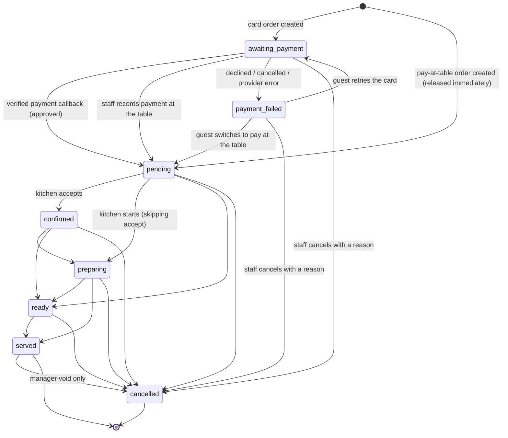

# Order state machine

The order lifecycle is owned by the database, not by any client. This document
is the contract; the enforcement lives in
`supabase/migrations/20260731090100_payment_safety.sql` and is covered by
`supabase/tests/payment-safety.test.ts`.

---

## Diagram



**The line that matters:** everything above `pending` is pre-kitchen. An order
in `awaiting_payment` or `payment_failed` has no ticket, does not appear in any
kitchen or waiter query, and is not revenue.

---

## Transition table

| From | To | Who may do it | How |
|---|---|---|---|
| — | `awaiting_payment` | guest | `guest_place_order` with `card_online` |
| — | `pending` | guest | `guest_place_order` with `cash` / `pos_terminal` |
| `awaiting_payment` | `pending` | payment system | `monri_apply_callback` → `release_order_to_kitchen` |
| `awaiting_payment` | `pending` | staff | `record_table_payment` (guest paid in the room instead) |
| `awaiting_payment` | `payment_failed` | payment system | `monri_apply_callback` (declined/cancelled/error) |
| `payment_failed` | `pending` | guest | `guest_switch_to_pay_at_table` |
| `payment_failed` | `awaiting_payment` | guest | retry — a new `monri_register_attempt` |
| `pending` | `confirmed` / `preparing` / `ready` | staff | `staff_update_order_status` |
| `confirmed` | `preparing` / `ready` | staff | `staff_update_order_status` |
| `preparing` | `ready` / `served` | staff | `staff_update_order_status` |
| `ready` | `served` | staff | `staff_update_order_status` |
| any non-terminal | `cancelled` | staff (manager once in production or paid) | `cancel_order` |
| `served` | `cancelled` | manager only | `cancel_order` |

Anything not in this table is rejected by the `enforce_order_integrity`
trigger with `check_violation`.

---

## Actor permissions

| Actor | Can | Cannot |
|---|---|---|
| Guest (anon, session token) | place an order, read their own tab, switch a failed card order to pay-at-table, request bill / waiter | set a total, set a payment status, move an order through the kitchen, see another table's orders |
| Staff (authenticated, `staff` role) | move an order along the kitchen flow, record cash or POS payment, mark fiscalization, claim/reprint tickets, cancel an order **before** production and **before** payment | cancel a paid or in-production order, refund, edit money fields directly |
| Manager (`admin` role) | everything staff can, plus cancel in-production/paid orders, void a served order, refund | write money fields directly (still goes through RPCs) |
| Payment system (service role) | register a payment attempt, apply a verified callback, release an order | anything else — the RPCs are the whole surface |

**Financial columns** (`total`, `tip_amount`, `payment_status`,
`payment_method`, `paid_at`, `paid_by`, `refunded_amount`,
`released_to_kitchen_at`, `order_code`, `fiscal*`) can only change inside a
`SECURITY DEFINER` function that sets the transaction-local
`lasoul.financial_ctx` GUC. A direct `UPDATE` from any client — including one
holding a valid staff session — raises `insufficient_privilege`.

> The GUC is transaction-local (`set_config(..., true)`), so the elevation ends
> with the RPC's transaction. It is not a session-wide unlock.

---

## Effects of each state

| State | Kitchen sees it | Ticket printed | Counted as revenue | Fiscalizable | Guest sees |
|---|---|---|---|---|---|
| `awaiting_payment` | no | no | **no** | no | "Confirming your payment" |
| `payment_failed` | no | no | **no** | no | "Payment was not completed" + recovery options |
| `pending` | yes (New) | yes, once | yes | yes | "Order received" |
| `confirmed` | yes | already | yes | yes | "Confirmed" |
| `preparing` | yes | already | yes | yes | "Preparing" |
| `ready` | yes (Ready) | already | yes | yes | "Ready" |
| `served` | recent | already | yes | yes | "Served" |
| `cancelled` | removed; queued tickets cancelled | n/a | **no** | no | "Cancelled" |

Revenue is defined exactly once, in the `completed_orders` view:

```sql
status NOT IN ('awaiting_payment', 'payment_failed', 'cancelled')
AND released_to_kitchen_at IS NOT NULL
```

Every report reads from that view or from `day_reconciliation()`.

---

## Payment status, separately

`orders.status` is about food. `orders.payment_status` is about money. They are
deliberately independent after release — a pay-at-table order is `pending`
(with the kitchen) and `unpaid` (money not collected) at the same time.

| `payment_status` | Meaning |
|---|---|
| `unpaid` | Nothing collected. Pay-at-table orders start here. |
| `pending` | An online card payment is in flight. **Not** money received. |
| `paid` | Confirmed: a verified callback, or a staff member recorded cash/terminal. |
| `failed` | The card was declined, cancelled or errored. |
| `partially_refunded` | Some money returned. |
| `refunded` | All money returned. |

The provider-side ladder in `payment_transactions.status` is monotonic —
`created → pending → approved → refunded`, with `declined`/`cancelled`/`error`
terminal — enforced by `payment_status_rank()`. A late or out-of-order callback
can never walk it backwards.

---

## Printing

A ticket exists only once an order is released. `claim_ticket_print` flips
`order_ticket_events.status` from `queued`/`failed` to `printed` atomically and
returns `true` only to the caller that won, so:

- two kitchen devices marked as printers cannot both print the same ticket;
- a page reload inside the auto-print window cannot reprint;
- a device that fails to print calls `report_ticket_print(ok = false)`, which
  returns the ticket to the queue and surfaces a **Reprint** button.

Cancelling an order sets any `queued`/`exported` ticket to `cancelled`.

---

## Reading the audit trail

Every transition and every financial action writes to `audit_log` with actor,
timestamp, before/after and reason. It is append-only: `INSERT`, `UPDATE` and
`DELETE` are revoked from `anon` and `authenticated`; only the `SECURITY
DEFINER` `write_audit()` can add rows, and nothing can change one.

```sql
SELECT created_at, action, actor_user_id, reason, before_state, after_state
  FROM public.audit_log
 WHERE entity_id = '<order id>'
 ORDER BY created_at;
```
